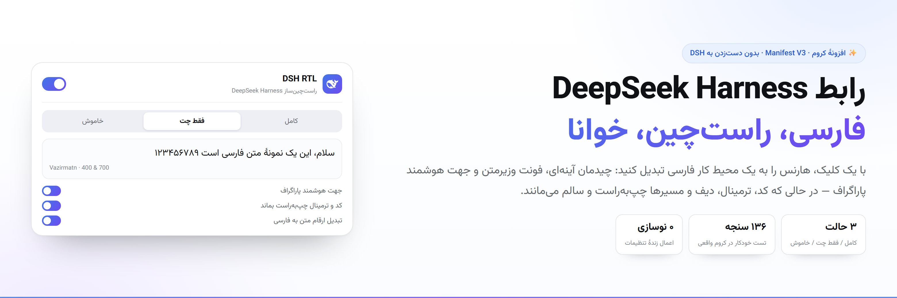
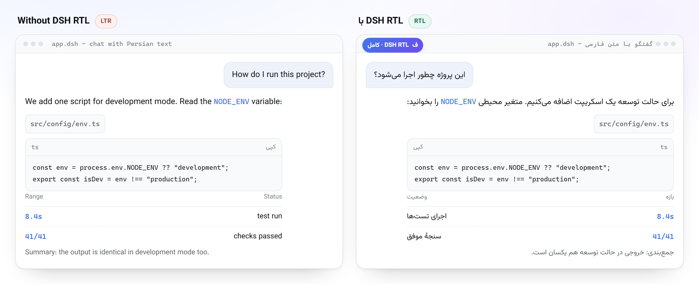
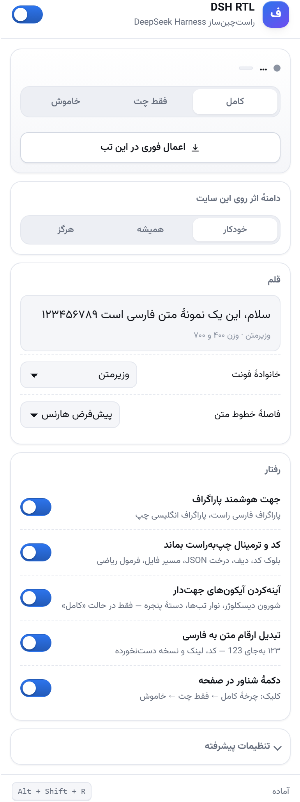

<div dir="rtl" align="right">

# 🪄 DSH RTL — راست‌چین‌ساز DeepSeek Harness

<div dir="ltr" align="center">

**فارسی** · [English](README.en.md)

[](manifest.json)
[](manifest.json)
[](manifest.json)
[](test/run-tests.ps1)
[](LICENSE)

</div>

**رابط وب DeepSeek Harness را به یک محیط کار فارسی تبدیل کنید** — با یک کلیک،
بدون دست‌زدن به کد DSH و بدون شکستن افزونه پس از هر به‌روزرسانی.

📐 چیدمان کاملاً آینه‌ای · ✍️ فونت وزیرمتن · 🧠 جهت هوشمند پاراگراف
و مهم‌تر از همه: 💻 کد، ترمینال، دیف، JSON و فرمول ریاضی **چپ‌به‌راست و سالم** می‌مانند.

<a href="#install"></a>

<div dir="ltr" align="center">

**[⬇️ نصب در ۳۰ ثانیه](#install)** · **[✨ قابلیت‌ها](#features)** · **[🖼️ پیش و پس](#demo)** · **[🛠️ رفع اشکال](#faq)**

</div>

---

## ✨ چرا DSH RTL؟

|  |  |
| --- | --- |
| 🎯 **سه حالت، یک کلیک** | «کامل» برای رابط یک‌دست فارسی، «فقط چت» برای وقتی می‌خواهید تنها متن گفتگو راست‌چین شود، و «خاموش» برای برگشت به حالت اصلی. |
| 🔤 **فونت وزیرمتن، همه‌جا** | به‌جای وصله‌کردن صدها سلکتور، توکن‌های رسمی تم بازنویسی می‌شوند؛ نتیجه یک‌دستی کامل در همهٔ کامپوننت‌هاست. |
| 🧠 **جهت هوشمند هر پاراگراف** | پاراگراف فارسی راست‌چین و پاراگراف انگلیسی چپ‌چین می‌شود، پس جمله‌های ترکیبی هم درست خوانده می‌شوند. |
| 🧩 **جزیره‌های چپ‌به‌راست** | کد، ترمینال، دیف، نتیجهٔ Read و Search، درخت JSON، مسیر فایل و KaTeX هیچ‌وقت آینه نمی‌شوند. |
| ⚡ **بدون نوسازی صفحه** | تنظیمات در فضای همگام‌سازی کروم ذخیره و بی‌درنگ روی همهٔ تب‌های باز DSH اعمال می‌شوند. |
| 🚫 **بدون پرش** | تا رسیدن تنظیمات هیچ‌چیز اعمال نمی‌شود، پس صفحه حتی یک لحظه هم حالت اشتباه را نشان نمی‌دهد. |
| 🔐 **کاملاً محلی** | هیچ داده‌ای جایی فرستاده نمی‌شود؛ مجوزها کمینه‌اند و دامنه‌های غیرلوکال فقط با تأیید خودتان اضافه می‌شوند. |
| 🛡️ **مقاوم به به‌روزرسانی** | ستون اصلی افزونه روی اتریبیوت‌های معنایی اپ سوار است، نه روی کلاس‌های هش‌شدهٔ بیلد. |

---

<a id="demo"></a>

## 🖼️ پیش و پس

یک گفتگوی نمونه، پیش از افزونه و پس از آن. جزیره‌های کد در هر دو حالت
چپ‌به‌راست می‌مانند و فقط جهت و قلم تغییر می‌کند:

<div dir="ltr" align="center">



<sub>نمای شبیه‌سازی‌شده از گفتگو — دکمهٔ شناور افزونه در نوار بالای قاب دیده می‌شود.</sub>

</div>

---

<a id="install"></a>

## 🚀 نصب در ۳۰ ثانیه

### پیش از شروع

- ✅ **کروم ۱۱۱ یا بالاتر** (یا هر مرورگر مبتنی بر Chromium با پشتیبانی از Manifest V3)
- ✅ **DeepSeek Harness** نصب‌شده و در حال اجرا — به‌صورت پیش‌فرض روی `http://127.0.0.1:3080`
- ✅ **هیچ پیش‌نیاز دیگری نیست** — نه Node.js، نه مرحلهٔ بیلد، نه نصب وابستگی

### گام‌به‌گام

**۱) کد را دریافت کنید.**
روی دکمهٔ سبز **Code** در بالای همین صفحه بزنید و **Download ZIP** را انتخاب کنید،
یا اگر Git دارید پوشه را کلون کنید:

```bash
git clone https://github.com/Sir-Adnan/deepseek-harness-rtl.git deepseek-harness-rtl
```

سپس فایل ZIP را در یک مسیر **دائمی** استخراج کنید. ⚠️ پوشه را بعد از نصب جابه‌جا یا
پاک نکنید؛ کروم افزونه را از همین مسیر اجرا می‌کند.

**۲) صفحهٔ افزونه‌های کروم را باز کنید.**
در نوار نشانی این نشانی را بنویسید و Enter بزنید:

```text
chrome://extensions
```

**۳) حالت توسعه‌دهنده را روشن کنید.**
کلید **Developer mode** در گوشهٔ بالا-راست صفحه را روشن کنید. با روشن‌شدن این کلید،
سه دکمهٔ تازه در بالای صفحه نمایان می‌شود.

**۴) افزونه را بارگذاری کنید.**
روی **Load unpacked** بزنید و **ریشهٔ پوشهٔ پروژه** را انتخاب کنید — همان پوشه‌ای که
فایل `manifest.json` در آن قرار دارد — و سپس **Select Folder** را بزنید.

✅ اگر همه‌چیز درست انجام شده باشد، کارت **DSH RTL** با آیکون آبی و بدون پیام خطا
در فهرست افزونه‌ها ظاهر می‌شود.

**۵) افزونه را به نوار ابزار سنجاق کنید.**
روی آیکون پازل (Extensions) در نوار ابزار کروم بزنید و کنار **DSH RTL** روی آیکون
سنجاق بزنید تا پاپ‌آپ همیشه در دسترس باشد.

**۶) رابط DSH را باز کنید.**
`http://127.0.0.1:3080` را در یک تب باز کنید و اگر از قبل باز بود، یک‌بار نوسازی کنید
(`Ctrl + R`). صفحه باید بی‌درنگ راست‌چین شود.

> 💡 **بررسی موفقیت نصب:** روی آیکون افزونه بزنید. اگر در بالای پاپ‌آپ نشانگر سبز و
> نام دامنهٔ جاری را دیدید، همه‌چیز درست است. اگر پیام **«اجرا نشده»** آمد، یک‌بار
> `Ctrl + R` بزنید یا دکمهٔ **«اعمال فوری در این تب»** را کلیک کنید.

### افزونه روی چه صفحه‌هایی فعال می‌شود؟

افزونه به‌طور پیش‌فرض روی `127.0.0.1` و `localhost` فعال می‌شود؛ آن هم **فقط اگر**
صفحه را واقعاً DSH تشخیص بدهد (از راه نشانه‌هایی مثل `window.__DSH_BOOT__`، عنوان صفحه،
فایل `manifest.webmanifest`، آیکون `favicon.svg` یا ریشهٔ اپ).

برای دامنه‌های دیگر — مثلاً وقتی DSH روی یک سرور محلی یا پورت دیگری اجرا می‌شود —
این سه گام را انجام دهید:

1. روی آیکون افزونه بزنید و به بخش **«دامنهٔ اثر روی این سایت»** بروید
2. گزینهٔ **«همیشه»** را انتخاب کنید
3. در دیالوگ مجوز کروم، **Allow** را بزنید

فقط همین یک دامنه به فهرست مجاز اضافه می‌شود و بقیهٔ وب‌سایت‌ها دست‌نخورده می‌مانند.

---

## 🔄 سه حالت نمایش

از پاپ‌آپ، از دکمهٔ شناور روی صفحه یا با میان‌بر `Alt + Shift + R` حالت‌ها را بچرخانید:

| حالت | چه چیزی تغییر می‌کند | مناسب برای |
| --- | --- | --- |
| 🟦 **کامل** | کل رابط آینه می‌شود: سایدبار به راست، کمپوزر و تب‌ها برعکس، نوار اسکرول به چپ | تجربهٔ یک‌دست و کامل فارسی |
| 🟪 **فقط چت** | تنها حباب پیام شما و پاسخ دستیار راست‌چین می‌شوند؛ سایدبار، هدر، تب‌ها، کمپوزر و همهٔ سطوح دیگر **دقیقاً دیفالت هارنس** می‌مانند | وقتی چیدمان اصلی هارنس را دوست دارید |
| ⬜ **خاموش** | هیچ‌چیز تغییر نمی‌کند و صفحه به حالت اول برمی‌گردد | مقایسه یا غیرفعال‌کردن موقت |

در هر سه حالت، کد و داده‌های فنی چپ‌به‌راست می‌مانند تا خواندن‌شان خراب نشود.

### از پشت صحنه چه می‌گذرد؟

| حالت | اتریبیوت‌های صفحه | پوستهٔ هارنس | محتوای گفتگو |
| --- | --- | --- | --- |
| **کامل** | `data-dsh-rtl="full"` به‌همراه `dir="rtl"` | راست‌چین می‌شود | راست‌چین می‌شود |
| **فقط چت** | `data-dsh-rtl="chat"` بدون `dir` | **دست‌نخورده** | راست‌چین می‌شود |
| **خاموش** | هیچ اتریبیوتی | دست‌نخورده | دست‌نخورده |

این جداسازی با **دو دروازهٔ مستقل** در CSS انجام می‌شود؛ به همین دلیل حالت «فقط چت»
واقعاً هیچ قاعده‌ای روی پوسته اعمال نمی‌کند:

```css
/* پوسته: فقط در حالت «کامل» */
html[data-dsh-rtl="full"][dir="rtl"] { … }

/* محتوا: در هر دو حالت */
html[data-dsh-rtl][data-dsh-rtl-chat="on"] { … }
```

---

<a id="features"></a>

## 🎛️ قابلیت‌ها

| قابلیت | توضیح |
| --- | --- |
| 🧭 **چرخش کامل رابط** | گذاشتن `dir="rtl"` روی ریشهٔ صفحه: سایدبار به راست می‌رود، کمپوزر و تب‌ها آینه می‌شوند و نوار اسکرول به چپ منتقل می‌شود |
| 🔤 **فونت فارسی** | بازنویسی توکن‌های رسمی تم (`--dsw-font-family` و `--ds-font-family-code`) تا همهٔ کامپوننت‌ها وزیرمتن بگیرند |
| 🧠 **جهت هوشمند پاراگراف** | هر پاراگراف بر پایهٔ اولین حرف قوی‌اش جهت می‌گیرد: متن فارسی راست و متن انگلیسی چپ |
| 🏝️ **جزیره‌های چپ‌به‌راست** | بلوک کد، ترمینال، دیف، نتیجهٔ Read و Search، درخت JSON، مسیر فایل و فرمول ریاضی |
| ✍️ **کمپوزر Lexical** | جهت با CSS اعمال می‌شود و نه با اتریبیوت `dir`، تا Lexical آن را بازنویسی نکند؛ کدهای درون‌خطی داخل متن هم چپ می‌مانند |
| 🔘 **دکمه‌ها و منوها** | چپ‌چین‌های پراکندهٔ اپ به ابتدای خط تبدیل می‌شوند و زیرمنو و منوی کشویی به لبهٔ درست می‌چسبند |
| 📝 **مارک‌داون** | بولت لیست، نقل‌قول، جدول و چک‌باکس تسک‌لیست آینه می‌شوند |
| 🪞 **آینه‌کردن آیکون‌ها** | شورون دیسکلوژر، نوار تب و دستهٔ پنجرهٔ شناور — با `scale` تا با `rotate` داخلی اپ تضاد پیدا نکند |
| 🪟 **داک و پنجرهٔ شناور** | ناحیه‌های رهاکردن پنل، دکمهٔ بستن تب و دستهٔ تغییر اندازه به سمت درست منتقل می‌شوند |
| 🔢 **تبدیل ارقام** | اختیاری: ارقام لاتین در متن گفتگو به ارقام فارسی تبدیل می‌شوند؛ کد، نشانی، نسخه و مسیر مستثناست |
| 🟣 **دکمهٔ شناور و میان‌بر** | قرص کوچک قابل‌جابه‌جایی با سه حالت رنگی و میان‌بر `Alt + Shift + R` برای چرخهٔ حالت‌ها |

---

<details>
<summary><b>🔬 چرا این‌طور کار می‌کند؟ (نگاه فنی)</b></summary>

<br/>

سه واقعیت از بررسی نسخهٔ نصب‌شدهٔ DSH (بستهٔ `dsh-web-frontend` و بسته‌های
`dsh-client-ui-*`) پایهٔ طراحی افزونه شد:

1. **اپ هیچ پشتیبانی RTL ندارد.** نه اتریبیوت `dir` می‌گذارد و نه قاعده‌ای برای
   `[dir=rtl]` در CSS دارد؛ پس افزونه باید واقعاً چیدمان را بچرخاند.
2. **فونت‌ها از متغیرهای CSS می‌آیند.** پلاگین `dsh-client-ui-theme` مقادیر
   `--dsw-font-family` و `--ds-font-family-code` را روی ریشه تعریف می‌کند و همهٔ
   ماژول‌ها از آن ارث می‌برند؛ پس فقط دو متغیر بازنویسی می‌شود، نه صدها سلکتور.
3. **اپ نقاط اتصال معنایی دارد.** اتریبیوت‌هایی مثل `data-terminal`، `data-diff`،
   `data-code-block-content`، `data-read`، `data-search`، `data-json-root-row`،
   `data-composer-input`، `data-lexical-editor` و `data-dockkit-*` دقیقاً همان
   چیزهایی هستند که برای جدا کردن «کد» از «متن» لازم است.

**نکتهٔ کلاس‌ها:** کلاس‌های اپ از نوع CSS Module با هشِ بیلد هستند؛ هش با هر بیلد عوض
می‌شود، ولی نام معنایی کلاس باقی می‌ماند. به همین دلیل سلکتورها با الگوی
`[class*="_markdown_"]` نوشته شده‌اند، نه با هش کامل.

**غلبه بر قواعد اپ بدون `!important`:** دروازهٔ CSS افزونه امتیاز specificity
معادل `(0,2,1)` دارد که یک پله بالاتر از قواعد خود اپ است؛ پس بدون `!important`
برنده می‌شود و خاموش‌کردن افزونه فقط برداشتن همین اتریبیوت‌هاست — بدون پرش و
بدون دوباره‌رندر.

**بدون پرش:** خواندن تنظیمات از حافظهٔ افزونه غیرهمگام است؛ پس افزونه تا رسیدن پاسخ
هیچ‌چیز اعمال نمی‌کند، مگر آنکه نسخهٔ کش‌شدهٔ همگام در دسترس باشد. بدون این محافظ،
صفحه یک لحظه حالت پیش‌فرض را می‌گرفت و بعد اصلاح می‌شد.

**ارثی‌نبودن جهت متن:** برای «جهت هوشمند پاراگراف» باید علاوه بر ظرف مارک‌داون،
خود پاراگراف‌ها، آیتم‌های لیست و سلول‌های جدول هم علامت‌گذاری شوند؛ وگرنه فقط متن
حباب جهت هوشمند می‌گیرد و پاراگراف‌های تودرتو نه.

</details>

---

## ⚙️ تنظیمات

همهٔ کنترل‌ها در پاپ‌آپ افزونه و با کلیک روی آیکون آن در دسترس‌اند:

<div dir="ltr" align="center">



<sub>پاپ‌آپ واقعی افزونه — تنظیمات پیشرفته در پایین همین پاپ‌آپ جمع شده است.</sub>

</div>

| بخش | کنترل‌ها |
| --- | --- |
| 🔌 **هدر** | کلید اصلی روشن و خاموش، به‌همراه وضعیت زندهٔ صفحهٔ جاری |
| 🎚️ **حالت نمایش** | کنترل سه‌قسمتی «کامل / فقط چت / خاموش» با نشانگر لغزان و دکمهٔ **اعمال فوری در این تب** |
| 🌐 **دامنهٔ اثر روی این سایت** | خودکار، همیشه یا هرگز |
| 🔤 **قلم** | خانوادهٔ فونت با **پیش‌نمایش زندهٔ متن فارسی**، به‌همراه فاصلهٔ خطوط |
| 🧠 **رفتار** | جهت هوشمند پاراگراف، چپ‌به‌راست ماندن کد و ترمینال، آینه‌کردن آیکون‌های جهت‌دار، تبدیل ارقام و دکمهٔ شناور |
| 🧰 **تنظیمات پیشرفته** | انتخابگرهای اضافی برای چپ‌به‌راست نگه‌داشتن، CSS سفارشی، تشخیص خودکار DSH و بازنشانی به پیش‌فرض |

> گزینهٔ «آینه‌کردن آیکون‌های جهت‌دار» تنها در حالت «کامل» اثر دارد و در حالت
> «فقط چت» خودکار بی‌اثر و کم‌رنگ می‌شود.

### دو راه فرار برای موارد خاص

- **انتخابگرهای LTR** — هر سلکتوری که بنویسید به فهرست «جزیره‌های چپ‌به‌راست» اضافه
  می‌شود. نمونه: `[data-testid="my-widget"]`
- **CSS سفارشی** — هر قاعدهٔ دلخواه، مستقیم روی صفحه تزریق می‌شود:

```css
html[dir="rtl"] .something { margin-inline-start: 12px; }
```

> 🔄 تنظیمات در فضای همگام‌سازی کروم ذخیره می‌شوند و **بدون نوسازی صفحه** و بلافاصله
> روی همهٔ تب‌های باز DSH اعمال می‌شوند.

---

## ⌨️ میان‌برها و کنترل‌ها

| کار | راه |
| --- | --- |
| 🔁 چرخهٔ حالت‌ها (کامل ← فقط چت ← خاموش) | میان‌بر `Alt + Shift + R` یا کلیک روی دکمهٔ شناور |
| 🖐️ جابه‌جایی دکمهٔ شناور | بکشید و رها کنید؛ موقعیت ذخیره می‌شود |
| ⚡ اعمال فوری روی تب جاری | دکمهٔ «اعمال فوری در این تب» در پاپ‌آپ |

---

<a id="faq"></a>

## 🛠️ رفع اشکال

| نشانه | علت و راه‌حل |
| --- | --- |
| 😐 می‌خواهم فقط متن چت راست‌چین شود و بقیه دیفالت بماند | حالت **«فقط چت»** را از پاپ‌آپ یا با میان‌بر `Alt + Shift + R` انتخاب کنید |
| 🤔 حالت «خاموش» را انتخاب می‌کنم ولی چیزی عوض نمی‌شود | «دامنهٔ اثر» روی این سایت بر حالت انتخابی اولویت ندارد؛ کلید اصلی را روشن و حالت را روی «کامل» بگذارید. اگر «دامنهٔ اثر» روی **«هرگز»** باشد، این سایت همیشه خاموش می‌ماند و باید آن را روی «خودکار» بگذارید |
| 🚫 پاپ‌آپ می‌گوید «DSH نیست» | صفحه DSH نیست، یا گزینهٔ «فقط صفحه‌های DSH» روشن است و نشانه‌ای پیدا نشد؛ **«همیشه»** را بزنید |
| 🔌 پاپ‌آپ می‌گوید «اجرا نشده» | افزونه بعد از باز شدن صفحه نصب یا فعال شده؛ صفحه را نوسازی کنید یا «اعمال فوری» بزنید |
| 🔤 فونت عوض نشد | یک‌بار صفحه را نوسازی کنید؛ فونت در منابع خود افزونه است و باید در دسترس قرار گیرد |
| ⬅️ جایی از رابط چپ ماند | آن سلکتور را در «انتخابگرهای LTR» بگذارید یا موقتاً «جهت هوشمند» را خاموش کنید |
| 🧩 بخشی از یک کامپوننت جدید به‌هم ریخت | در «تنظیمات پیشرفته» با CSS سفارشی اصلاحش کنید و همان سلکتور را در «انتخابگرهای LTR» بگذارید |
| 😵 دکمهٔ شناور مزاحم است | در پاپ‌آپ خاموشش کنید |
| 🧱 کارت افزونه در صفحهٔ افزونه‌ها خطا نشان می‌دهد | مطمئن شوید ریشهٔ پوشه‌ای را انتخاب کرده‌اید که فایل `manifest.json` در آن است و پوشه را جابه‌جا نکرده‌اید |

---

## 📁 ساختار پروژه

```text
manifest.json            MV3 — مجوزها، content script، منابع web_accessible
src/rtl.css              کل منطق RTL و فونت‌ها (فقط با اتریبیوت دروازه فعال می‌شود)
src/content.js           خواندن تنظیمات، تشخیص DSH، نگهبان‌ها، ارقام، دکمهٔ شناور
src/popup.html/.css/.js  رابط تنظیمات فارسی
fonts/                   وزیرمتن (نسخهٔ متغیر و نسخهٔ ارقام فارسی) — ۳۱۰KB
icons/                   آیکون‌های ۱۶، ۳۲، ۴۸ و ۱۲۸
docs/                    تصویرهای README به‌همراه اسکریپت ساخت‌شان
test/                    تست‌های مرورگری و اجراکننده
```

---

## 🧪 تست‌ها

قواعد RTL در برابر قواعد واقعی اپ شکننده‌اند (specificity، ویژگی‌های فیزیکی و
متغیرهای CSS)؛ برای همین سه لایه تست خودکار در مرورگر واقعی وجود دارد:

```powershell
pwsh -File test/run-tests.ps1
```

| تست | چه چیزی را می‌سنجد |
| --- | --- |
| `test/selftest.html` | یک DOM شبیه‌سازِ DSH می‌سازد، **قواعد خود اپ را بعد از شیت افزونه** تزریق می‌کند (بدترین حالت cascade) و **۷۲ چیز** را در سه حالت می‌سنجد: بارگذاری واقعی فونت، جزیره‌های چپ‌به‌راست، آینه‌شدن مارک‌داون، flipped شدن ویژگی‌های فیزیکی، آینه‌نشدن آیکون ابزارها، دست‌نخوردن پوسته در حالت «فقط چت» و برگشتن کامل صفحه به حالت اول در حالت «خاموش» |
| `test/popup-probe.html` | **۲۱ سنجهٔ** چیدمان پاپ‌آپ: عرض ثابت ۳۸۴ پیکسل، نبود سرریز افقی، بریده‌نشدن برچسب‌ها، راست‌چین بودن، چپ‌به‌راست ماندن تکست‌اریای CSS، پیش‌نمایش فونت و کنترل‌های سه‌قسمتی |
| `test/e2e.js` | **خودِ افزونه را در کروم بارگذاری می‌کند** (از راه CDP) و **۴۳ سنجه در سه فاز** می‌گیرد: فاز A حالت کامل، فاز B حالت «فقط چت» که پوسته باید دست‌نخورده بماند، و فاز C حالت خاموش. شامل لود و رندر واقعی فونت `woff2` از نشانی افزونه و پاک‌سازی کش بین فازها |

خروجی فعلی روی کروم ۱۵۲: `PASS=72 FAIL=0`، `PASS=21 FAIL=0` و در E2E
`ALL-PASS (43 checks)` — جمعاً **۱۳۶ سنجه**.

> **نکتهٔ کروم ۱۳۷ و بالاتر:** سوئیچ `--load-extension` از کروم رسمی حذف شده است
> ([Selenium](https://github.com/SeleniumHQ/selenium/issues/15788)،
> [uBOL](https://github.com/uBlockOrigin/uBOL-home/discussions/342)). تست E2E به‌جای آن
> از دامنهٔ `Extensions` در DevTools Protocol استفاده می‌کند
> (`--enable-unsafe-extension-debugging` و `Extensions.loadUnpacked`) و تنظیمات هر فاز را
> از صفحهٔ خود افزونه در `chrome.storage.sync` می‌نویسد. اگر مرورگر اجازهٔ بارگذاری ندهد،
> اسکریپت با کد ۳ خارج می‌شود و دو تست دیگر همچنان معتبرند.

### ساخت تصویرهای README

```bash
node docs/build-images.mjs
```

اسکریپت با کروم headless سه تصویر `docs/popup.png`، `docs/demo.png` و `docs/hero.png`
را می‌سازد و حاشیه‌های خالی را پیکسل‌به‌پیکسل می‌بُرد. برای مسیر دلخواه کروم، متغیر
محیطی `CHROME_PATH` را تنظیم کنید.

---

## 🔐 حریم خصوصی و مجوزها

- **مجوزها کمینه است:** `storage` برای تنظیمات، `scripting` برای پشتیبانی از دامنه‌های
  دلخواه و `activeTab` برای خواندن نشانی تب جاری. دسترسی به دامنه‌های غیرلوکال فقط با
  تأیید صریح خودتان گرفته می‌شود.
- **هیچ داده‌ای جایی فرستاده نمی‌شود:** افزونه کاملاً محلی کار می‌کند و هیچ درخواست
  شبکه‌ای برای ردیابی یا تحلیل ندارد.
- **فونت:** [Vazirmatn](https://github.com/rastikerdar/vazirmatn) اثر صابر راستی‌کردار،
  با مجوز SIL Open Font License 1.1 همراه افزونه توزیع شده است؛ متن مجوز در
  [`fonts/LICENSE-Vazirmatn.txt`](fonts/LICENSE-Vazirmatn.txt) قرار دارد.
- **مجوز کد:** [MIT](LICENSE) — فونت‌های همراه افزونه همچنان زیر SIL OFL 1.1 می‌مانند.
- **سازگاری با آینده:** اگر روزی DSH نام‌های CSS Module خود را عوض کند، افزونه نمی‌شکند
  و فقط بخشی از تعمیرهای ظاهری بی‌اثر می‌شود؛ ستون اصلی افزونه (جهت، فونت و جزیره‌های
  کد) بر پایهٔ اتریبیوت‌های معنایی است که پایدارترند.

---

## 💬 پیشنهاد یا ایدهٔ دیگری دارید؟

اگر ترجیح می‌دهید همین کار به‌جای افزونهٔ کروم، یک **پلاگین خودِ DSH** باشد
(بسته‌های `dsh-client-ui-*` با CSS اختصاصی خودش)، بگویید تا همان را هم بسازم؛ مزیتش نبود
کروم و کار کردن روی همهٔ کلاینت‌هاست و عیبش نیاز به نصب در محیط DSH.

**اگر DSH RTL تجربهٔ کاری‌تان را بهتر کرد، با یک ستاره از پروژه حمایت کنید.** ⭐

</div>
